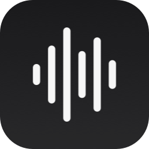

<div align="center">



# Glagol 2

**Локальный голосовой ввод для macOS — batch-режим.**
Нажал хоткей → продиктовал → отпустил → текст напечатался.

Никаких облаков, никакой телеметрии. Никакого streaming. Просто работает.

[](#требования)
[](https://swift.org)
[](#движки-распознавания)
[](LICENSE)

</div>

---

## Что это

Менюбар-приложение для macOS, которое принимает диктовку и печатает её в активное поле любого приложения. Распознавание полностью локальное на твоей Apple Silicon. На выбор — **три движка**: две модели **Qwen3-ASR** (Alibaba, MLX/GPU) для multilingual-речи с английскими терминами и **GigaAM v3** (Сбер, ONNX/CPU) — лёгкая модель топ-качества для чисто русской диктовки (см. [Движки распознавания](#движки-распознавания)).

**Архитектура batch:** запись копится в памяти от старта до stop'а. Когда юзер останавливает запись (хоткей, Esc, или auto-stop по тишине), вся запись разом подаётся в Qwen-модель, результат печатается одним блоком.

> 💡 **Зачем batch?** Streaming-диктовка фундаментально борется с современными LLM-based ASR-моделями (Qwen3-ASR, Whisper). Hallucination на silence, word-tail leakage при cut'ах, дрейф интерпретации на длинных буферах — всё это родовые болезни streaming-режима. Batch-режим избегает их по построению: модель видит полный контекст, никаких частичных прогонов, никаких склеек, глобально-консистентная пунктуация. Latency почти не страдает — на 20-секундной диктовке Qwen на M-серии Apple Silicon отдаёт результат за 0.6с.

## Возможности

- **Полностью локально** — модели работают на Apple Silicon (Qwen — GPU через MLX, GigaAM — CPU через ONNX Runtime). Никаких внешних API.
- **Три движка на выбор** — переключение прямо из menubar-меню; выбор запоминается между запусками. Неактивный движок выгружается из памяти (экономия RAM)
- **Кастомный хоткей** — двойной модификатор (⌃⌃ по умолчанию) или произвольное сочетание
- **Floating overlay** — плавающая капсула во время диктовки (адаптация Aqua Voice): живой waveform реагирует на голос + кнопки пауза/продолжить и стоп
- **Индикатор готовности** — menubar-иконка: жёлтая «готовлюсь» (железо раскручивается ~250мс) → красная «слушаю» (запись реально идёт). Начинаешь говорить по красной — первые слова не теряются
- **Анимация обработки** — пока модель распознаёт, в поле ввода крутятся песочные часы ⏳⌛ (заменяются на текст по готовности)
- **Auto-stop по тишине** — записи завершаются сами через настраиваемую паузу (7-30 секунд)
- **Пауза/продолжение** — на паузе микрофон не пишет, но движок не глушится (resume мгновенный)
- **Hotwords / context-prompt** — пользовательский словарь редких терминов биасит модель к их сохранению (`Cursor`, `Kubernetes`, и др.)
- **Защита от утечки промпта** — на тишине LLM-ASR склонны галлюцинировать context-prompt в выход; ловится тремя барьерами (VAD-gate + вырезание цепочек терминов + полный отброс)
- **Multilingual code-switching** — русский с английскими IT-терминами в одной фразе ловится корректно
- **Menubar-only** — никакой Dock-иконки, всегда под рукой
- **Надёжная инжекция** — текст печатается через CGEvent с chunking'ом по 8 символов (работает в терминалах, IDE, чатах) и сбросом модификаторов (не ломается при остановке двойным Ctrl)

## Движки распознавания

Движок выбирается в menubar-меню (раздел «Модель»). Выбор сохраняется и применяется при следующем запуске. По умолчанию — Qwen 1.7B.

| Модель | Движок | Размер | Сильна в | Особенности |
|---|---|---|---|---|
| **Точная** — Qwen3-ASR 1.7B *(по умолчанию)* | MLX / GPU | ~1.6 ГБ | Multilingual, IT-речь с английскими терминами | Code-switching из коробки (`Kubernetes`, `Cursor`). Лучшее качество |
| **Быстрая** — Qwen3-ASR 0.6B | MLX / GPU | ~0.7 ГБ | То же, но быстрее и легче | Чуть ниже точность, заметно меньше памяти |
| **Лёгкая** — GigaAM v3 (Сбер) | ONNX / CPU | ~0.22 ГБ | Чисто русская речь | Топ-качество русского, встроенная пунктуация и капитализация. **Только русский** — английские термины транслитерирует в кириллицу. Работает на CPU |

**Когда что:** для русско-английской IT-диктовки — Qwen (1.7B точнее, 0.6B легче). Для чистого русского без иностранных слов — GigaAM: легче всех, быстрая, не нагружает GPU.

Модели **скачиваются по требованию** при первом выборе (Qwen — в `~/Library/Caches/qwen3-speech/`, GigaAM — в `~/Library/Caches/glagol/gigaam-v3/`), в DMG не зашиты. GigaAM тянется напрямую с [HuggingFace](https://huggingface.co/csukuangfj/sherpa-onnx-nemo-transducer-punct-giga-am-v3-russian-2025-12-16).

## Требования

| | |
|---|---|
| **OS** | macOS 15+ (Sequoia, для MLState API в speech-swift) |
| **CPU** | Apple Silicon — M1 / M2 / M3 / M4 |
| **Свободное место** | под кэш моделей: Qwen 1.7B ~1.6 ГБ / Qwen 0.6B ~0.7 ГБ / GigaAM v3 ~0.22 ГБ (качается только выбранная) |
| **Разрешения** | Микрофон + Accessibility (для CGEvent-инжекции текста) |

Для сборки: Xcode 16+ + Metal Toolchain (см. ниже).

## Быстрый старт

```bash
git clone https://github.com/kenigteh/glagol-2.git
cd glagol-2
open glagol.xcodeproj
# ⌘R в Xcode для запуска
```

SPM сам стянет [`speech-swift`](https://github.com/soniqo/speech-swift). При первом запуске приложение скачает модель Qwen3-ASR-1.7B-4bit (~1.6 ГБ) в `~/Library/Caches/qwen3-speech/`.

Если Xcode ругается `cannot execute tool 'metal'`:

```bash
xcodebuild -downloadComponent MetalToolchain   # 688 МБ, один раз
```

MLX компилирует Metal-шейдеры через эту тулчейну.

## Архитектура

```
Микрофон → AudioRecorder (AVAudioEngine, 16kHz mono Float32)
              ↓  накапливает в [Float] до stop'а; RMS → audioLevel (waveform) + voiced-счётчик (VAD-gate)
              │
              ├─→ первый буфер → isCapturing → overlay показывается, иконка краснеет
              │
   on stop / VAD-auto-stop:
              ↓  VAD-gate: достаточно голоса?
          BatchASR.transcribe(audio: [Float]) async → String
              │     ├─ QwenASR     → speech-swift / MLX (GPU)
              │     └─ GigaAMSherpaASR → sherpa-onnx / ONNX (CPU)
              ↓  prompt-leak фильтр (вырезание цепочек терминов / отброс)
          TextInjector (CGEvent → активное поле, chunks of 8 chars, flags=[])
```

### Файлы

| Файл | Назначение |
|---|---|
| `BatchASR.swift` | Port (Protocol) для batch ASR-движка — `transcribe(audio:) → String` |
| `QwenASR.swift` | Адаптер Qwen3-ASR через speech-swift / MLX (GPU) |
| `GigaAMSherpaASR.swift` | Адаптер GigaAM v3 через sherpa-onnx / ONNX Runtime (CPU) + загрузчик модели с прогрессом |
| `SherpaOnnx.swift` | Swift-обёртка над C-API sherpa-onnx (offline transducer recognizer) |
| `ModelChoice.swift` | Плоский enum выбора модели/движка (Qwen 1.7B / 0.6B / GigaAM) |
| `AudioRecorder.swift` | AVAudioEngine pipeline, накопление сэмплов, audioLevel, VAD auto-stop, pause/resume |
| `DictationOverlay.swift` | Плавающая капсула (SwiftUI waveform + кнопки) в non-activating NSPanel |
| `HotkeyManager.swift` | CGEventTap, кастомный hotkey-recording panel |
| `TextInjector.swift` | CGEvent injection chunks of 8 chars + сброс модификаторов |
| `HotwordsStore.swift` | UserDefaults + текстовый файл со словарём пользователя |
| `glagolApp.swift` | AppDelegate, NSStatusItem, overlay/icon lifecycle, prompt-leak фильтр, wiring |

## Бенчмарк

Замеры на тестовом аудио 21.6с (русский с английскими IT-терминами), Qwen3-ASR-1.7B-4bit на Apple Silicon:

| Метрика | Значение |
|---|---|
| Cold load модели (с диска) | ~6-7с |
| Warm load (повторный запуск приложения) | ~3с |
| **Inference на 21.6с аудио (warm)** | **~0.63с** |
| Real-time factor | **34×** |

Для сравнения: WhisperKit Large-v3-Turbo на том же аудио — 2.06с inference, 13-14с warm load. Qwen быстрее **в 3× на warm-inference** и **в 4× на warm-load**.

## Связь с Glagol 1

Это **subtractive рерайт** из ветки `qwen-asr` оригинального [Glagol](https://github.com/kenigteh/glagol) (заархивирован). Из v1 удалены:

- VAD-streaming сегментация (`SileroVAD`, `StreamingVADProcessor`)
- Sentence-completeness merge (pending/accumulated state machine)
- ForcedAligner cut alignment
- LocalAgreement-2 candidates с penalty system
- Pause-fallback, word-growth guard, прочая боль streaming-режима

Что переиспользуется один в один:

- HotkeyManager
- TextInjector (с фиксом chunking-by-8 для терминалов)
- HotwordsStore + UI-словаря
- Menubar UI, panels, first-launch tour
- Иконка, AppIcon, DMG-фон

Код QwenASR.swift ужался с **700 строк до 270**. Все остальные файлы трогали минимально.

## Скрипты

| | |
|---|---|
| `scripts/package.sh` | Собрать релизный DMG end-to-end |
| `scripts/generate_icon.swift` | Регенерация AppIcon (waveform на charcoal squircle) |
| `scripts/generate_dmg_background.swift` | Регенерация фона DMG-окна |
| `scripts/set_dmg_icon.swift` | Прицепить custom Finder-иконку к любому файлу |

## Спасибо

- **[QwenLM/Qwen3-ASR](https://huggingface.co/Qwen)** ([Alibaba](https://github.com/QwenLM)) — Qwen3-ASR модель (SOTA open-source ASR 2026)
- **[soniqo/speech-swift](https://github.com/soniqo/speech-swift)** — Swift wrapper для Qwen3-ASR через MLX
- **[ml-explore/mlx](https://github.com/ml-explore/mlx)** ([Apple](https://github.com/apple)) — ML framework для Apple Silicon
- **[GigaAM](https://github.com/salute-developers/GigaAM)** ([Сбер / SaluteDevelopers](https://github.com/salute-developers)) — GigaAM v3 ASR-модель для русского
- **[k2-fsa/sherpa-onnx](https://github.com/k2-fsa/sherpa-onnx)** — ONNX-рантайм для offline-распознавания + конвертация GigaAM ([@csukuangfj](https://huggingface.co/csukuangfj))
- **[SF Symbols](https://developer.apple.com/sf-symbols/)** — иконка `waveform` (Apple)

## Лицензия

[MIT](LICENSE) © 2026 Artem Sakovskii

Модель Qwen3-ASR распространяется по лицензии Apache 2.0, GigaAM v3 — по лицензии MIT (Сбер). См. их репозитории на HuggingFace.
